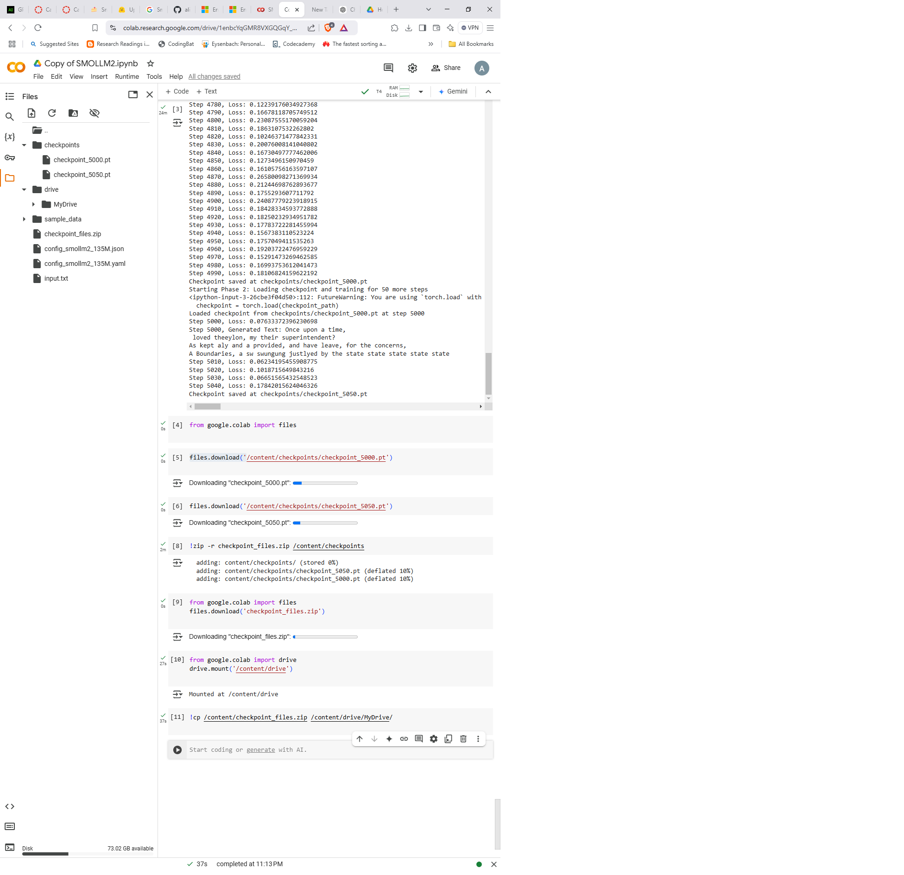
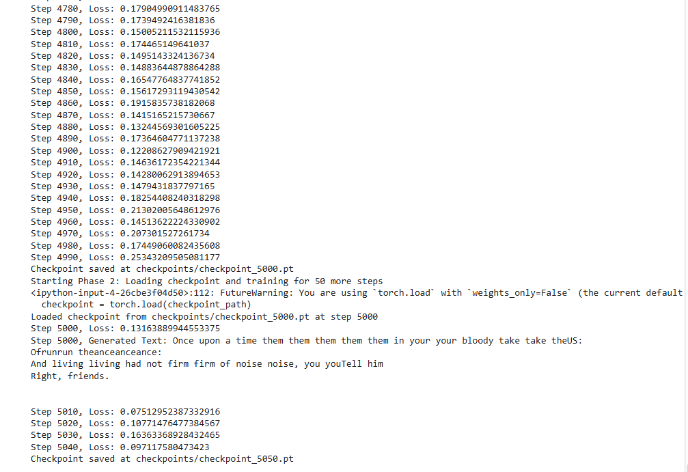

# SMOLLM2

This repository contains code for a transformer-based language model.  
All training steps were performed in Google Colab, producing checkpoints larger than 1GB.  
Quantization was used to reduce checkpoint size, and the resulting quantized model  
was pushed to a Hugging Face Space for deployment.

## Model Architecture
The model (see `model.py`) implements:
- Token embeddings + position embeddings
- Several transformer blocks (attention + feed-forward)
- RMSNorm layers for normalization
- Rotary positional embeddings (RoPE) for better context handling

### Explanation of model.py Architecture
The model consists of:
- RMSNorm for normalization
- RotaryPositionalEmbedding for applying continuous positional embeddings
- TransformerBlock with multi-head attention and feed-forward network
- TransformerModel that includes embeddings, multiple TransformerBlocks, and a final normalization + linear head

### Detailed Architecture Overview
- RMSNorm: Applies RMS-based normalization to stabilize training.
- RotaryPositionalEmbedding: Injects sinusoidal positional information into hidden states.
- TransformerBlock: 
  - Normalizes input tensors, applies self-attention (split into Q, K, V projections, followed by scaled dot-product attention).
  - Contains a feed-forward module with gating (gate_proj) and up/down projections.
  - Uses residual connections after attention and feed-forward.
- TransformerModel:
  - Has an Embedding layer (token + position).
  - Stacks multiple TransformerBlocks.
  - Ends with a final RMSNorm + linear (lm_head) for language modeling.
  - Includes a generate method for autoregressive text generation.

### Layer and Parameter Calculation
- Each TransformerBlock has learnable parameters from:
  - Self-attention projections (Q, K, V, O)
  - Feed-forward (gate_proj, up_proj, down_proj)
  - RMSNorm layers
- Total parameters ≈ [(hidden_size^2) * 4 (attn APIs) + (hidden_size * intermediate_size) * 2 + ...] × num_hidden_layers
- The final layer (lm_head) and embedding layers also contribute to total parameter count.

### Model Parameter Reference
Based on model.py and config_smollm2_135M.json:
- hidden_size = 576
- num_hidden_layers = 30
- intermediate_size = 1536
- num_attention_heads = 9
- vocab_size = 49152
- rms_norm_eps = 1e-5
- max_position_embeddings = 2048

### Logs and Diagnostics
Below are sample logs illustrating the training progress:
- SMOLColab.png showing the training environment in Colab
- 
- 

## Deployment
The quantized checkpoint is available on Hugging Face, and an application is live at:
https://huggingface.co/spaces/Tousifahamed/SmolTextGen

You can clone this repo and install dependencies from `requirements.txt`. Then run `app.py` to launch locally.
